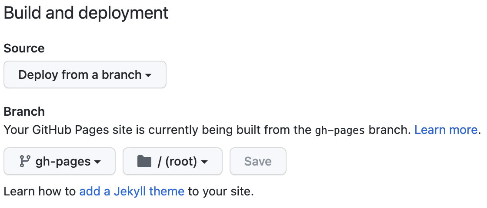

# fusuma
FUSUMAのお勉強

## 環境(dockerfile)

- Node12.x系でしか動作しないようなので、バージョンは注意したほうがいい
- chromiumが入ってないとFUSUMAインストール時にエラーになるので、念のためaptのアップデートも

```dockerfile
FROM node:12

# apt update
RUN apt update
RUN apt upgrade -y
```

## chromium install
```
apt install chromium
```

## install

```bash
npm i fusuma -D
```

## init

```bash
npx fusuma init
```

## start

```bash
npx fusuma start
```

## package.jsonの追加
- initでpackage.jsonは追加されないので、手動でスクリプトを追加

```json
{
    "name": "FUSUMA",
    "scripts": {
        "start": "fusuma start",
        "start:prod": "fusuma start-prod",
        "build": "fusuma build",
        "deploy": "npm run build && fusuma deploy",
        "pdf": "npm run build && fusuma pdf"
    }
}
```

## GitHub Pagesにデプロイ

- `npm script`の`deploy`でビルドされたサイトが`gh-pages`というブランチでpushされる
- Pagesの設定からgh-pagesのブランチでrootを選んでおけば、しばらくすると表示される



## 実際のページ
https://kazukinoto.github.io/fusuma/
